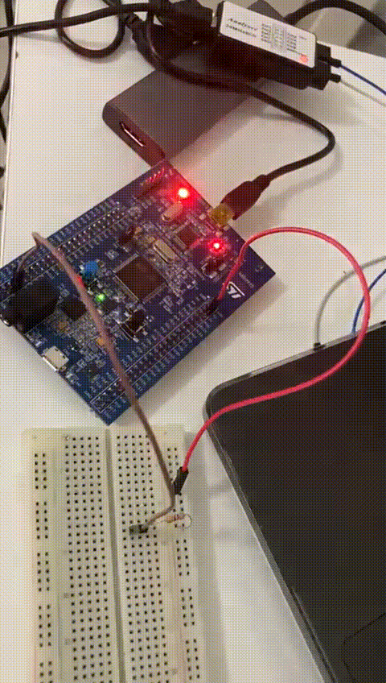
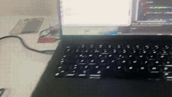

# STM32F407 Bare-metal Projects

A collection of **bare-metal STM32F4 projects in C**, demonstrating:

- GPIO control and LED toggling  
- Button interrupts using EXTI  
- SPI communication and peripheral-level programming  
- RCC clock configuration and microcontroller setup  

Each project includes **demo GIFs** for easy visualization of the functionality.

---

## LED Toggle Demo

---

## Button Interrupt Demo

---

## SPI Application Demo

---

## SPI Slave STM32F103 Example

A **register-level SPI slave example** using STM32F103C8T6.  
This project demonstrates receiving data from a SPI master (e.g., STM32F407 or other) and handling it at the peripheral/register level.  

### Connections

- SPI2 Pins:  
  - PB12 → NSS  
  - PB13 → SCLK  
  - PB14 → MISO (not used in this example)  
  - PB15 → MOSI  
- Clock: 8 MHz  
- Minimal register-level code, no HAL or LL used  

