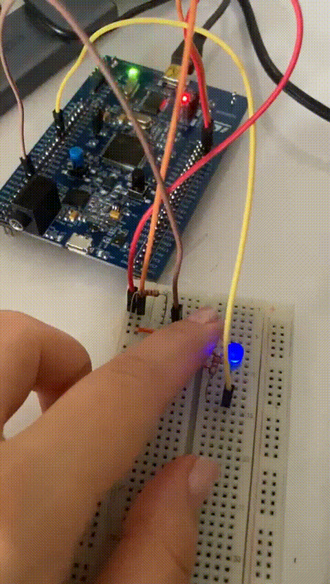
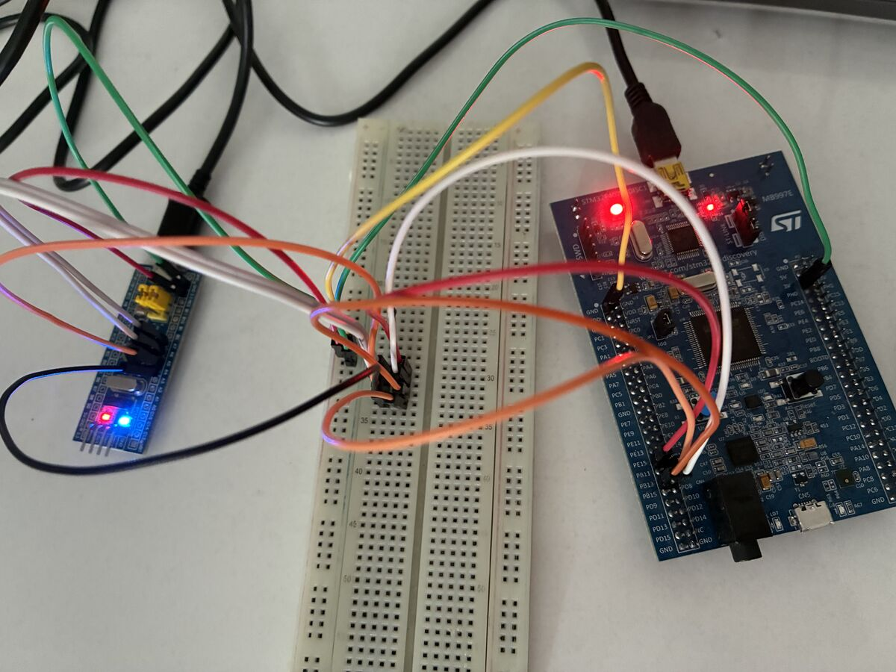
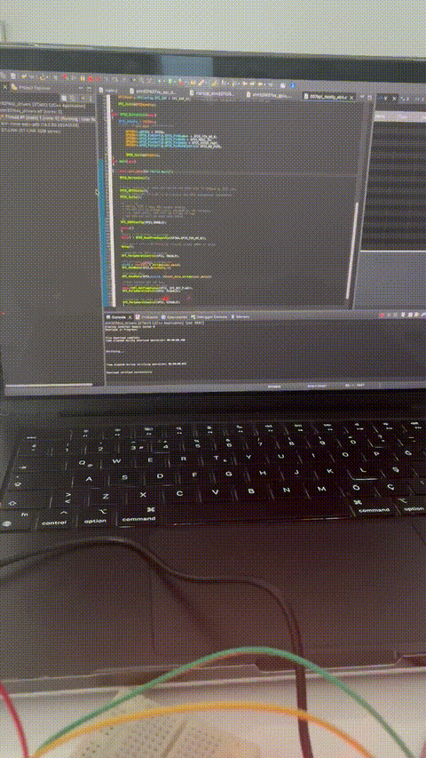

# STM32F407 Bare-Metal Projects


A collection of bare-metal STM32 projects written in C, focused on low-level
microcontroller programming: peripheral configuration, interrupt handling,
and direct hardware control.

Every driver and example in this repository is implemented through **direct
register-level programming** — no ST HAL, no LL libraries. The goal is to
build a real, practical understanding of how the MCU actually works under
the abstraction layers most tutorials rely on.

## Table of Contents

- [Hardware & Technologies](#hardware--technologies)
- [Repository Structure](#repository-structure)
- [Projects](#projects)
  - [01 — Peripheral Clock Enable](#01--peripheral-clock-enable)
  - [02 — HSE Clock Measurement](#02--hse-clock-measurement)
  - [03 — HSI Clock Measurement](#03--hsi-clock-measurement)
  - [04 — GPIO / SPI Driver Library](#04--gpio--spi-driver-library)
  - [05 — SPI Slave (STM32F103C8T6)](#05--spi-slave-stm32f103c8t6)
- [Getting Started](#getting-started)
- [Documentation](#documentation)
- [Engineering Focus](#engineering-focus)
- [Roadmap](#roadmap)
- [License](#license)

## Hardware & Technologies

| Category | Details |
|---|---|
| Microcontrollers | STM32F407 (Cortex-M4), STM32F103C8T6 (Cortex-M3) |
| Language | C |
| Programming level | Bare-metal / register-level |
| Peripherals | GPIO, EXTI, SPI, RCC |
| Libraries | No HAL / No LL (see [note](#05--spi-slave-stm32f103c8t6) on project 05) |
| IDE / Toolchain | STM32CubeIDE (GCC ARM toolchain) |
| Debugging | On-hardware testing, logic-level and serial verification |

## Repository Structure

```
stm32f407-baremetal-project/
├── projects/
│   ├── 01-peripheral-clock-enable/   # ADC peripheral clock via RCC registers
│   ├── 02-hse-clock-measurement/     # External oscillator routed to MCO1
│   ├── 03-hsi-clock-measurement/     # Internal oscillator routed to MCO1
│   ├── 04-gpio-spi-drivers/          # Custom GPIO/SPI driver library + examples
│   └── 05-spi-slave-f103/            # STM32F103 acting as SPI slave
├── docs/                             # Peripheral notes (GPIO, SPI protocol deep-dives)
├── media/                            # Demo GIFs / clips referenced below
├── LICENSE
└── README.md
```

Each folder under `projects/` is a **self-contained STM32CubeIDE project**
(its own `.project`, `.cproject`, `Startup/`, linker script, etc.), so any of
them can be imported into STM32CubeIDE independently.

## Projects

### 01 — Peripheral Clock Enable

`projects/01-peripheral-clock-enable`

The smallest possible register-level example: enables the peripheral clock
for the ADC1 peripheral directly through the `RCC_APB2ENR` register and sets
a control bit in `ADC_CR1`, with no framework involved at all. A good
starting point for reading memory-mapped register access in raw C.

**Demonstrates:** RCC peripheral clock gating, direct pointer-based register
access, `#define`-based register mapping.

### 02 — HSE Clock Measurement

`projects/02-hse-clock-measurement`

Enables the external oscillator (HSE), waits for the `HSERDY` flag, switches
the system clock source to HSE, and routes it out through `MCO1` on `PA8` so
it can be measured on an oscilloscope or logic analyzer.

**Demonstrates:** HSE enable/ready sequencing, `RCC_CFGR` clock-source
switching, MCO1 configuration, GPIO alternate-function setup for clock
output.

### 03 — HSI Clock Measurement

`projects/03-hsi-clock-measurement`

Same idea as project 02, but for the internal high-speed oscillator (HSI),
also routed out through `MCO1` for measurement.

**Demonstrates:** HSI-based MCO1 routing, `RCC_CFGR` bit-field manipulation.

### 04 — GPIO / SPI Driver Library

`projects/04-gpio-spi-drivers`

The core of this repository: a reusable, register-level **GPIO and SPI
driver library** for the STM32F407 (`drivers/Inc`, `drivers/Src`), plus a set
of numbered example applications built on top of it in `Src/`.

| Example | File | Demonstrates |
|---|---|---|
| LED Toggle | `001led_toggle.c` | GPIO clock enable, output mode, direct pin toggling |
| LED + Button (polling) | `002led_button.c` | GPIO input read, polling-based control |
| LED + Button (external) | `003led_button_ext.c` | External button wiring, debounce handling |
| Button Interrupt | `005button_interrupt.c` | EXTI + NVIC configuration, ISR-driven GPIO |
| SPI TX Test | `006spi_tx_testing.c` | SPI peripheral bring-up, register-level TX |
| SPI TX to slave | `007spi_txonly_stm.c` | Full master-side SPI transmission to project 05 |

> **How to switch the active example:** STM32CubeIDE only compiles one
> `main()` at a time. In the project's build configuration, all example
> files except the currently active one are excluded from the build
> (right-click a file → **Resource Configurations → Exclude from Build**).
> To try a different example, exclude the current one and include the file
> you want to run instead.

**LED Toggle demo:**


[Full-resolution video](media/led_toggle/led_toggle_demo.mp4)

**Button Interrupt demo:**



[Full-resolution video](media/button_interrupt/button_interrupt_demo.mp4)

**SPI Application demo:**


[Full-resolution video](media/spi_application/spi_application_demo.mp4)

### 05 — SPI Slave (STM32F103C8T6)

`projects/05-spi-slave-f103`

A second board, an STM32F103C8T6 ("Blue Pill"), configured as an SPI slave
that receives data from the STM32F407 master in project 04 and toggles its
onboard LED on each message.

**Configuration**

| Setting | Value |
|---|---|
| SPI mode | Slave |
| Clock | 8 MHz |
| NSS | Hardware-controlled |

**Connections**

| STM32F103 Pin | SPI Function |
|---|---|
| PB12 | NSS |
| PB13 | SCLK |
| PB14 | MISO |
| PB15 | MOSI |





> **Note on HAL usage:** unlike every other project in this repository,
> project 05 is generated from STM32CubeMX and links against ST's
> `STM32F1xx_HAL_Driver`. This is intentional — the slave side exists to
> provide a realistic communication partner for the register-level SPI
> master in project 04, and the vendor HAL/CMSIS files it bundles retain
> ST's own license terms (see `projects/05-spi-slave-f103/Drivers/`).

## Getting Started

1. Install [STM32CubeIDE](https://www.st.com/en/development-tools/stm32cubeide.html).
2. Clone this repository:
   ```bash
   git clone https://github.com/nurglelmas/stm32f407-baremetal-project.git
   ```
3. In STM32CubeIDE: **File → Open Projects from File System…** and point it
   at whichever folder under `projects/` you want to import.
4. Build and flash to an STM32F407 (projects 01–04) or an STM32F103C8T6
   (project 05) over ST-Link.

## Documentation

The [`docs/`](docs) folder contains write-ups on the peripheral concepts
used throughout the driver library:

- [SPI — Introduction](docs/spi/spi_intro.md)
- [SPI — Bus Configurations](docs/spi/spi_bus_configurations.md)
- [SPI — CPOL / CPHA](docs/spi/spi_cpol_cpha.md)
- [SPI — Slave Select](docs/spi/spi_slave_select.md)
- [SPI — Slave Management](docs/spi/spi_slave_management.md)
- [GPIO — Pin Constraints](docs/gpio/gpio_pin_constraints.md)
- [Serial Protocols — Overview](docs/serial_protocols.md)

## Engineering Focus

The main focus of this repository is understanding how STM32 peripherals
work at the register level, rather than relying on high-level abstraction
libraries. Implementing these peripherals manually provides practical
experience with:

- MCU memory-mapped registers
- Peripheral clock management (RCC)
- GPIO and alternate-function configuration
- Interrupt architecture (EXTI/NVIC)
- SPI communication, master and slave roles
- Embedded debugging on real hardware
- Hardware/software interaction

## Roadmap

Planned additions:

- [ ] UART driver
- [ ] I2C driver
- [ ] Timer configuration / PWM generation
- [ ] DMA-based peripheral communication
- [ ] More structured, reusable peripheral drivers
- [ ] Unit tests where applicable
- [ ] Detailed debugging/troubleshooting notes per peripheral

## License

This repository (all original register-level driver code and examples) is
released under the [MIT License](LICENSE). Third-party vendor code bundled
under `projects/05-spi-slave-f103/Drivers/` (ST's HAL/LL/CMSIS files)
remains under ST's own license terms.
